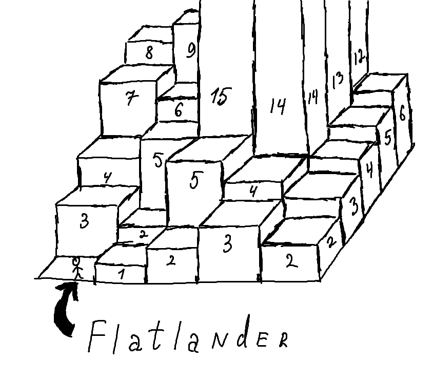

# Flatlander

## Technology used
C#, WindowsForms, VisualStudio

## Overview
Inspired by the book "[Flatland: A Romance of Many Dimensions](https://en.wikipedia.org/wiki/Flatland)" by [Edwin Abbott](https://en.wikipedia.org/wiki/Edwin_Abbott_Abbott) I've implemented a game where player should direct an *Flatlander* to the top of the 3D mountain.

## About project
### Gameplay
You are the red rectangle.

You are placed on the 3D plane like this one:

But you can see only a 2D slice, just like Flatlander can.

Your point is to climb to the hifgest point of the "plain".

You can switch to the neighbour stair, if its height differs no more than on 1.

You can rotate the Flatlander on 90 degree, so he could see the other perspective of the "plain".

You also have a limited ability to raise or lower the level of the stairs you are currently on.

### Control
- ↓ / ↑ - to increase or decrease the level of the current stair
- ← / → - are for going to the backward/forward
- Space - is for changing direction of view
- R - is for resterting level

## Program example

