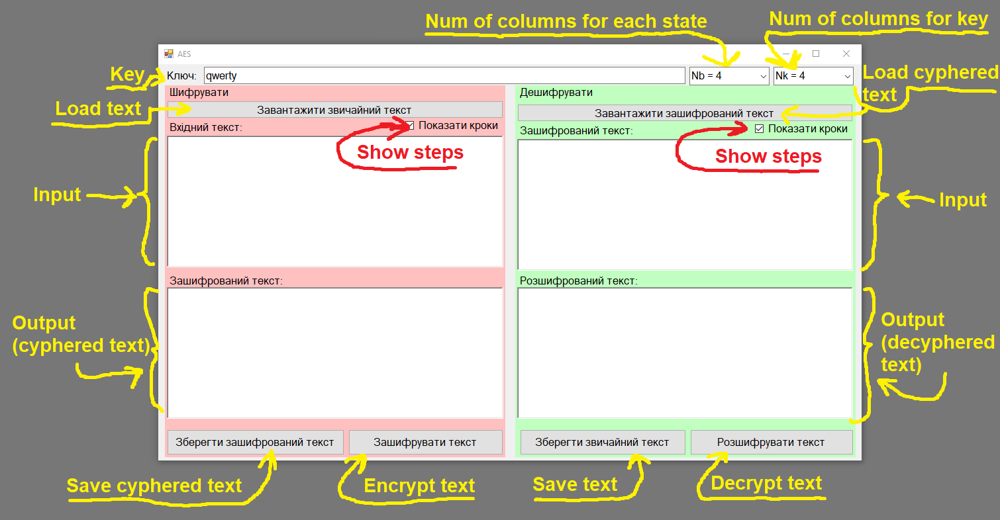
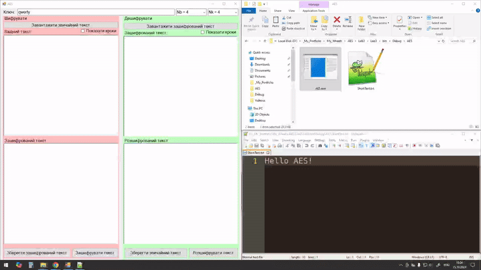

# AES

## Technology used
C#, WindowsForms, Math, Algorithms, dataStructure, Cyphering, VisualStudio

## Overview
Program that implements work of the easiest version of [AES](https://en.wikipedia.org/wiki/Advanced_Encryption_Standard) algorithm, including encoding and decoding of text.

## About project
This is a study project while I was learning basics of cyber security. The program allows you to encode, decode, save, load and show precisely the steps of AES algorithm.

## UI
The program divided into two parts: the encoding one (the left side), and decoding one (the right side):

### Encoding

For encoding text you can type it into the top left text box, or **load it from file (top left button)**;

Then input a key into the most top text box - it can be any sequence of symbols;

Also you can change check box, for showing steps of encoding (not necessary)

Finally, to encode your text with your key press button that says "Зашифрувати текст" (ukr. "Encode text").

The result will be shown in the bottom left part of window.

Optionally you can save result in the file.

### Decoding

To decode text it's easier to load from saved file, but nothing prevents you from typing it ;)

Press button "Завантажити зашифрований текст" (ukr. "Load cyphered text") in the top right corner of the window to load text you'd like to decode;

Check the key: if the key is different, than result will be wrong.

Finally, to decode your text press button that says "Розшифрувати текст" (ukr. "Decode text").

The result will be shown in the bottom right part of window.

Optionally you can save result in the file.

## Program example

