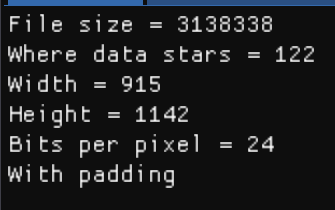
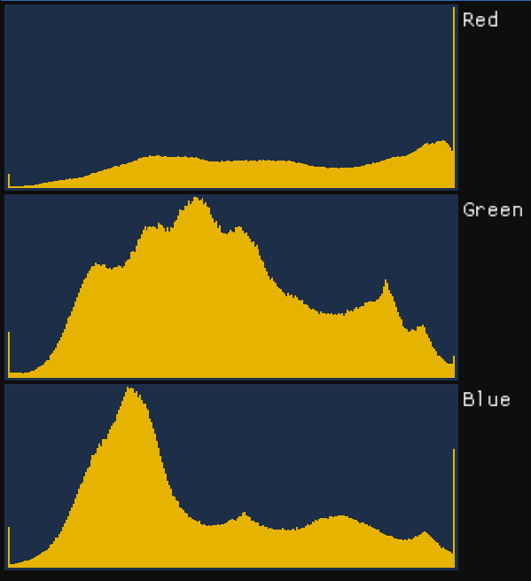
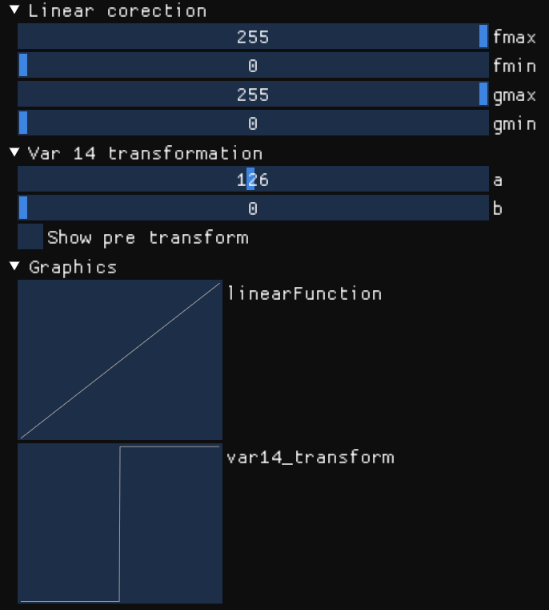
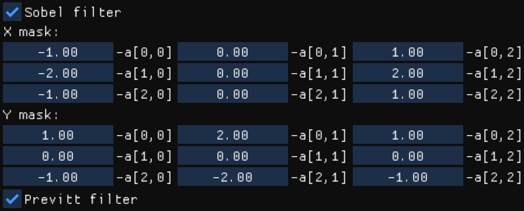

# Technology used
C++, GLFW, ImGui, OpenGL, Bitmap, math

# Overview
A program that implements image filters like [Sobel](https://en.wikipedia.org/wiki/Sobel_operator) and [Prewett](https://en.wikipedia.org/wiki/Prewitt_operator) operators.

# About project
This project is a result of my study in basics of picture filtering and a playground for reading/writing bmp-files from zero.

Project itself consists of 2 main parts:
1. Control window
2. Picture window

Basically you can 
- Input-Output image system
- File info
- Point filters
- Matrix filters

### IO BMP-image
When you push **Open BMP-file** button - program checks, if the chosen file actually has a BMP format and opens it.

After opening the file appears second window - the picture itself.

### File info
When the file is open - on the "File info" tab you can see the image characteristics such as size, bits per pixel and other.

Also in "Histogram" tab you can check how many times each of RGB colors appears:

### Point filters
Point filter is a filter that changes every pixel paerticularly.

To make long story short, one pixel goes into the filter, and one goes out.

In this case I implemented two filters: linear and step filters.

It's easy to represent filters as functions and plot them:

### Matrix filters
These kind of filters are a bit different from point filters.

They work like this: we take a square of nine pixels, apply them into 3 by 3 matrix and converting summary result to one pixel.

Nine in, one out.

In this case I made Sobel and Prewett filters (which also called operators).

Where I made the Sobel operator generalized :)

## Examples

