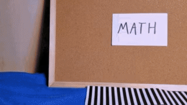
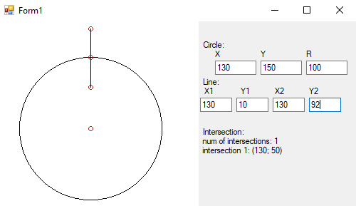
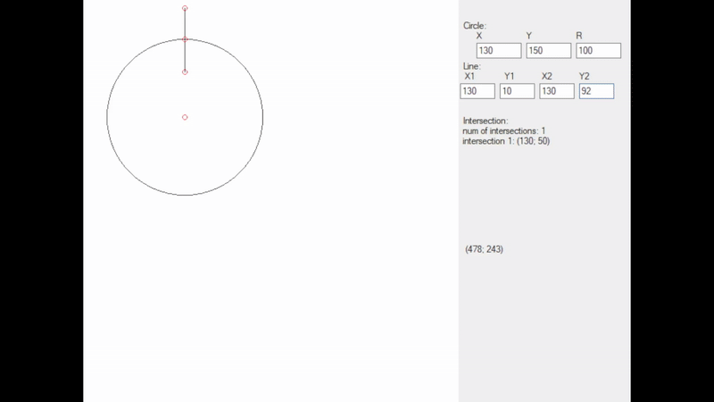

# Technology used
C#, WindowsForms, Bitmap, math

# Overview
A program that simulates circle, line and intersection between them.

# About project
Sometimes in other projects I've needed some kind of quick solution for this problem so I could just plug it in and know that it JUST WORKS.

So i did this project. As an aside I also added simple UI and visualisation.

Basically there is nothing to talk about: as an input we have:
- coordinates of circle
- radius of circle
- coordinates of the beginning of the line
- coordinates of the end of the line

As output we have:
- coordinates of intersection points (if they exist in the space of real numbers)

# Math

There are three options:
1. no intersection
2. one intersection
3. two intersections

Using simple math we know, that any equation of a line can be represented as a parametric equation:

$$
\begin{cases}
x = at+x_1 & \quad \text{where } a=x_2-x_1\\
y = bt+y_1 & \quad \text{where } b=y_2-y_1
\end{cases}
$$

where **t** changes from 0 to 1.

And having the equation of circle:

$$(x-x_0)^2 + (y-y_0)^2=R^2$$

Now our task is to insert **t** in circle equation and bring it to this view:

$$At^2 + Bt + C = 0$$

Using some math magic I've concluded that:

1. $$A = ((x_2-x_1)(x_2-x_1))+((y_2-y_1)(y_2-y_1))$$

2. $$B = 2((x_2 - x_1)(x_1 - x_0) + (y_2 - y_1)(y_1 - y_0))$$

3. $$C = (x_1 - x_0)^2 + (y_1 - y_0)^2 - R^2$$

Everyone knows that there are two solutions from quadratic equation

$$t1 = {-B + \sqrt{D} \over{2A}}$$

and

$$t2 = {-B - \sqrt{D} \over 2A}$$

where

$$D = {B^2 - 4AC}$$

Now time for conclusions:

- if D less then zero => no solution
- if both solutions are outside range (0; 1) => no solution
- if both solutions are between 0 and 1 => two solutions
- if only one solution is between 0 and 1 => one solution

after conclusions we insert **t1** and **t2** in the parametric line equation, which will bring us to solutions.

# Examples

