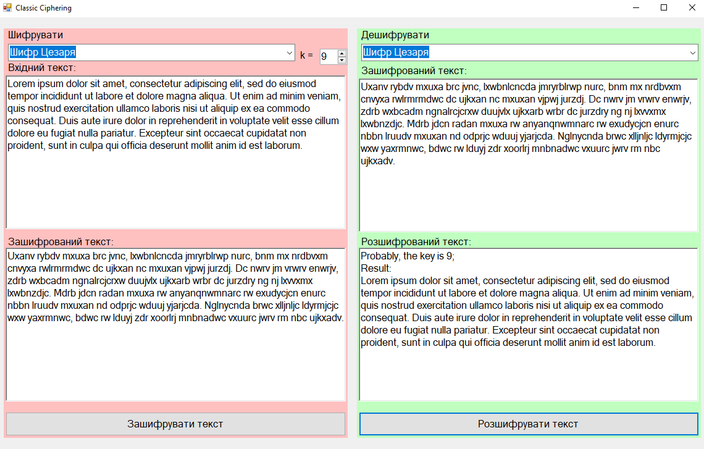
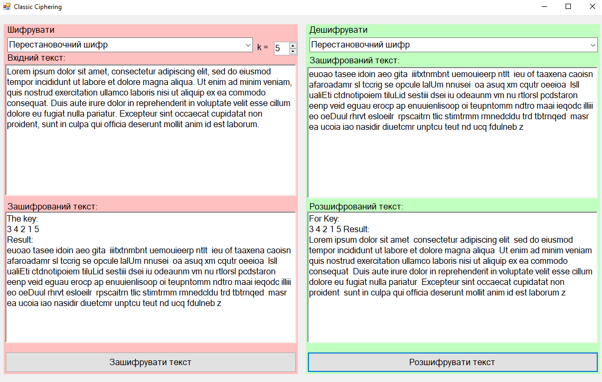

# Technology used
C#, WindowsForms, math, cyphering

# Overview
A program that implements encoding and decoding of two classic cyphering algorithms: [Caesar cipher](https://en.wikipedia.org/wiki/Caesar_cipher) and [Transposition cipher](https://en.wikipedia.org/wiki/Transposition_cipher)

# About project
This project is a result of my study in cyphering algorithms.

## Examples

Caesar cipher

Transposition cipher

