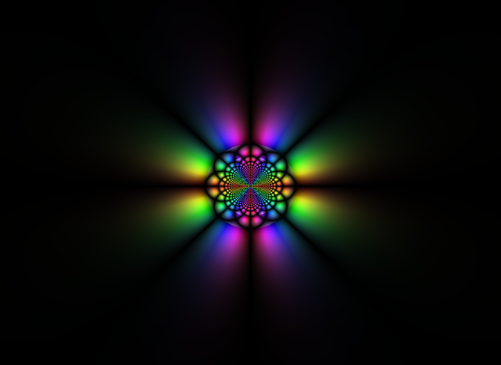

# Technology used
C#, WindowsForms, math, algorithms

# Overview
A program that allows the user to see a parameterized function in the space of complex numbers.

# About project
The problem about showing comlex function on 2D plane is that each complex number consists of imaginary and real parts.

So in this case to show complex function of complex argument we'll need a 4D space plane, which is quite real, but quite confusing to see how function actually looks like.

To solve this problem some clever people have come to conclusion to use colors to represent complex functions.

I've implemented it.

To solve this task I've wrotten lib for complex functions, to make easyer to write any complex function. Aside from classic operations (like +, -, \*, \/) in lib I also added such operations as inversion, logarythm, finding argument of complex number, finding its module, cos, sin and exponentiation.

For representing complex function on 2D plane we take a point on the plane as an input:

$$input = {x(re)+y(im)}$$

Then calculate function and get some other complex number:

$$out = {a(re)+b(im)}$$

Then we convert it in HSV color system, where

$$H = {argument(out)}$$

,

$$S = {module(out)}$$

and 

$$V = {|sin(a \pi)|*|sin(b \pi)|}$$

Finally we show our HSV color on the plane in pixel (x, y)

## Examples

