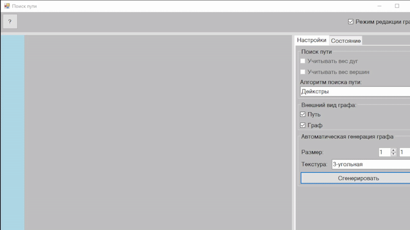
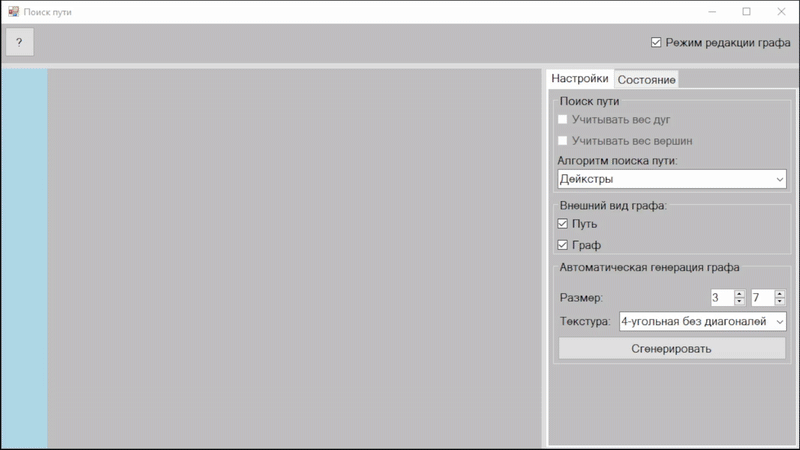
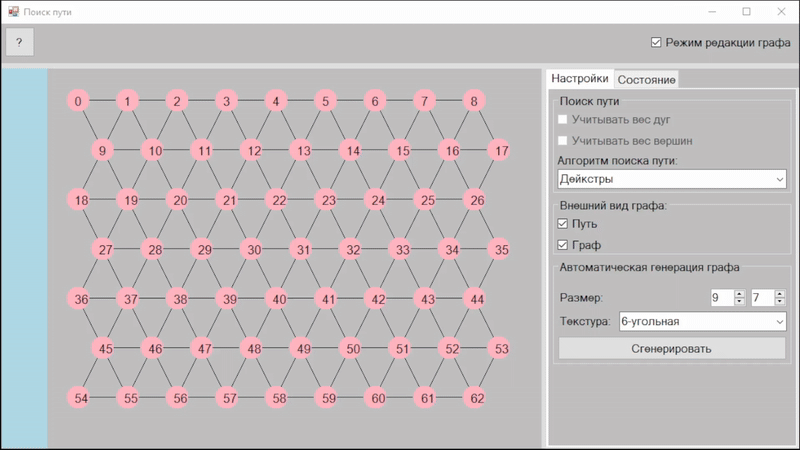
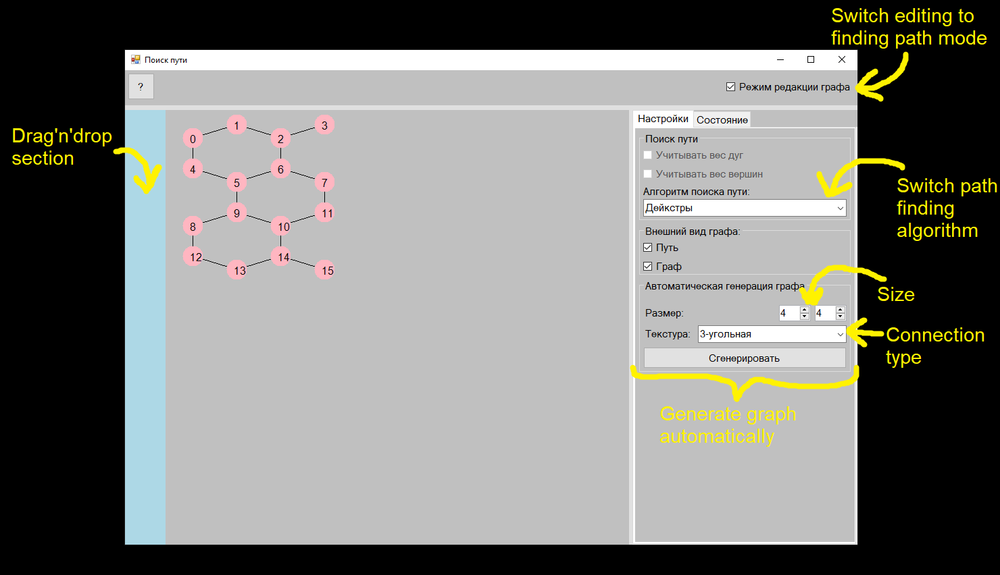
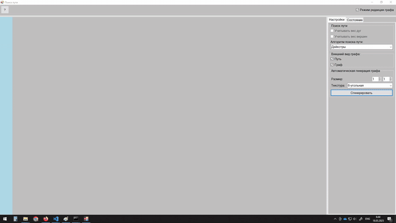

# Technology used
C#, OOP, WindowsForms, math, algorithms

# Overview
A program implements interactive path finding simulation, using [Dijkstra's algorithm](https://en.wikipedia.org/wiki/Dijkstra%27s_algorithm).

# About project
Project consists of to main parts:
- graph construction
- finding path on it

### Graph construction
There are two basic options of graph construction:
1. vertex by vertex:

2. auto generated set:

in this case you can build
- graph with square connection (without diagonales)
- graph with triangular connection
- graph with square connection (with diagonales)
- graph with hexagonal connection

To delete vertex - drag'n'drop it to the left side of the window.

### Finding path
Here you still can move vertices, but can't remove them, or connections between.

To set red point to some vertex - click on the vertex with right mouse button

## UI

## Examples

