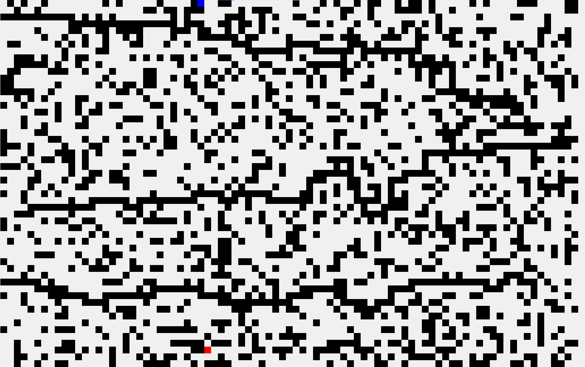
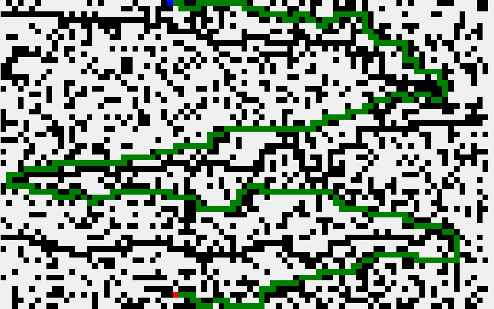
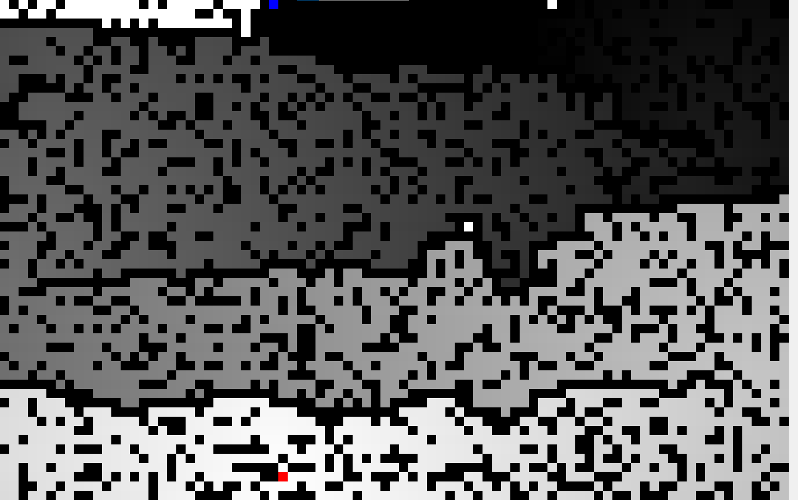

# Technology used
C#, OOP, WindowsForms, math, algorithms

# Overview
A program that implements path finding simulation, using [Lee algorithm](https://en.wikipedia.org/wiki/Lee_algorithm) (sometimes also called wave algorithm).

# About project
In this project I implemented *(guess what)* Lee algorithm for path finding on a square map with diagonals.

The program is very simple: we have a map where every cell is either empty or is a barrier.

Then user sets two points (both with LMC): point *from* and point *to*.

where beginning point is red and ending point is blue

Then user can find a way between those points:

For the curious ones program allows to see wave (gradient) that was formed after the algorithm worked:

