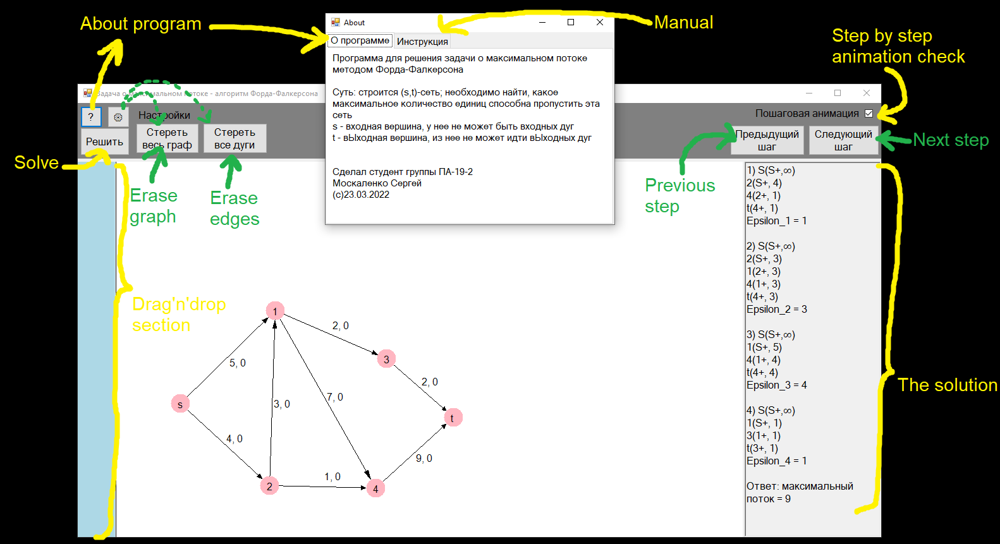
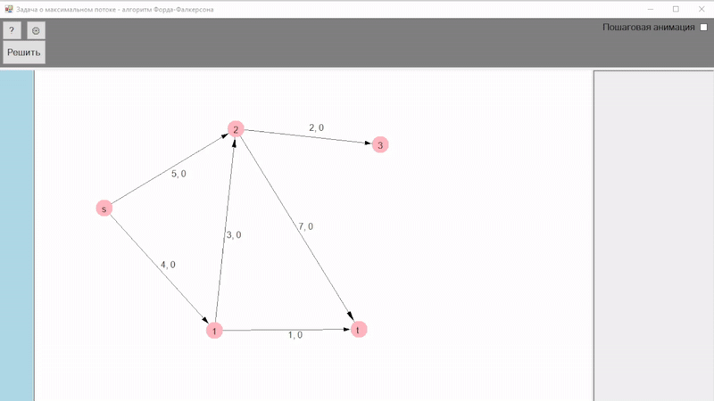

# Technology used
C#, OOP, WindowsForms, math, algorithms

# Overview
A program implements [Ford-Fulkerson algorithm](https://en.wikipedia.org/wiki/Ford%E2%80%93Fulkerson_algorithm) (FFA) to calculate maximum throughput of a [flow network](https://en.wikipedia.org/wiki/Flow_network)

# About project
This project is a result of my study in optimisation methods course.

The whole point is that there is a source that has only outgoing flow and a sink that has only incoming flow.

There are some other intermediate vertices between source and sink.

The question is what is the maximum throughput of the network?

User can build any type of flow network as a graph.

User has two options in solving problem:
1. solve it fast, without visualization
2. solve it step by step, with visualization

## UI

## Examples
Solution for a small flow network, step by step:

