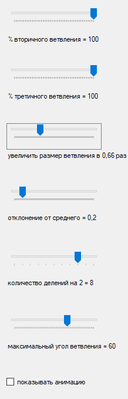
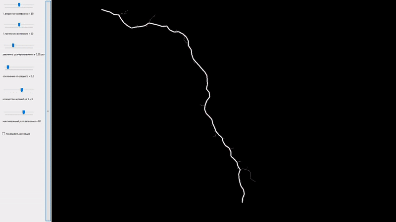

# Lightning

## Technology used
C#, WindowsForms, Math, Algorithms, DataStructure, VisualStudio

## Overview
Showing of parametrised lightning between two given points

## About project
This project I've made for fun, while studying [L-systems](https://en.wikipedia.org/wiki/L-system).

## UI
To make a lightning - hover the mouse to the begining point, hold left mouse button and drag to the second point like this:

And you'll get something like this:

You can also change the parameters of the lightning:

[translation to english from up to bottom]:
- % of secondary branching =...
- % of tertiary branching =...
- scale size of the branching by ... times
- deviation from the average =...
- num of binary divisions =...
- max angle of branching =... (in degrees)
- show animation

## Program example

## Brief math explanation
To build a lightning between two given points we must:
1. Build a straight line between points;
2. Divide this line in a half;
3. The middle point shift by the deviation param relative to the normal of primary line;
4. For each half of the polygonal chain do steps (1-2-3) n times (**where n = num of binary divisions**);
5. For each division of primary line get the probability of branching;
6. Take scale of the primary line length and angle and you'll get the secondary line;
7. For each secondary line do steps (1-2-3) relative to the secondary line;
8. Relatively to each secondary line do steps (5-6-7) to create tertiary lines.

Easy!