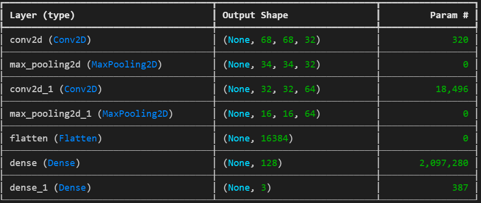
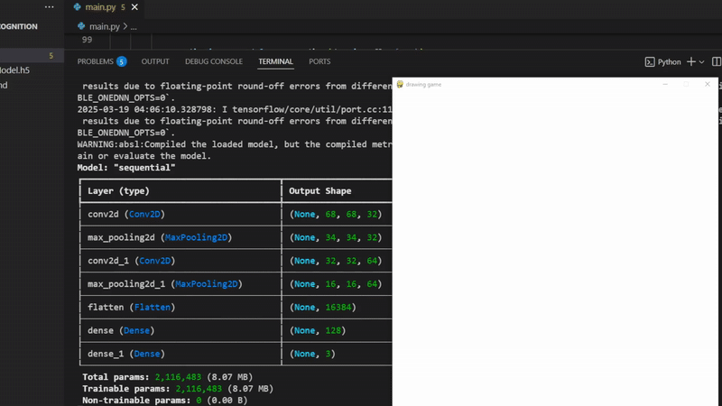

# Technology used
Python, TensorFlow, numpy, math, algorithms

# Overview
Program that can guess one of three basic shapes the user entered: circle, triangle and rectangle.

# About project
This project is a result of my beginning study in neural networks with python.

This is a classic classification problem, where NN should guess to which class the figure belongs.

Training and testing data was taken [here](https://github.com/frobertpixto/hand-drawn-shapes-dataset)

After rearranging this data in correct order for testing and learning folders I've played with parameter and came up with this convolutional neural network:

Code that I used for rearranging is commented in the end of the file :)

For convenience I saved resulting NN so I wouldn't have to learn new NN each time the program runs.

To make UI easier and faster I used [pygame](https://www.pygame.org/news) library

As input user draws a figure on the window and as output NN returns result in console

## Example

