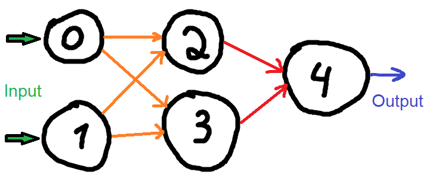
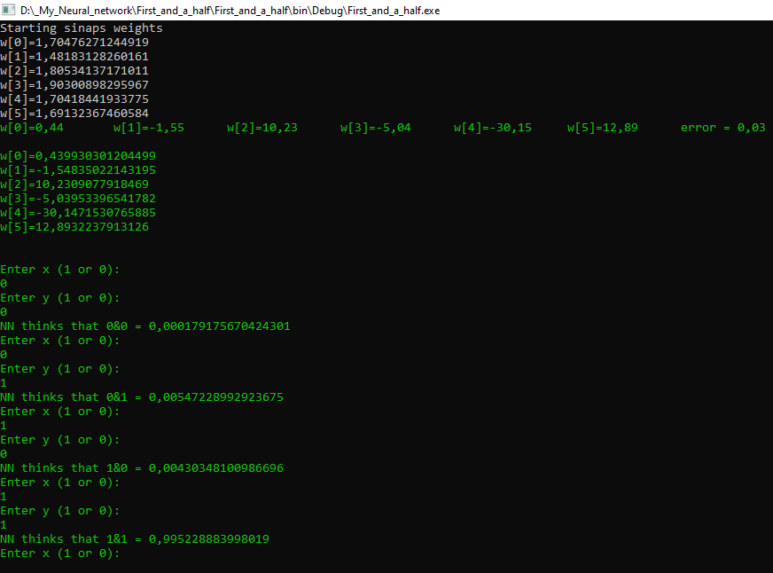

# Technology used
C#, OOP, WindowsForms, math, algorithms

# Overview
Program that realises [backpropagation algorithm](https://en.wikipedia.org/wiki/Backpropagation) for simple neural network.

# About project
In this project NN teaches to solve simple boolean equation:

$$x&y$$

where **x** and **y** are input of the NN and output is a logical solution of $$x&y$$.

After studying NN allows user to use itself for solving the problem :)

### Architecture
NN itself consists out of 5 neurons and 3 layers:
1. *input layer* has two input neurons. One of them is for **x** variable, the other one is for **y** variable.
2. *hidden layer* has another two neurons, that fully connected with *input layer*
3. *output layer* has the last one neuron, that fully connected with *hidden layer* 

Visually NN looks like this:

P.S. everything, including achitecture, algorithm, input and output is written on pure C# without any additional library :)

## Examples
Example of randomly chosen weights of synapses

Then goes a study process and user inputs as NN verification

