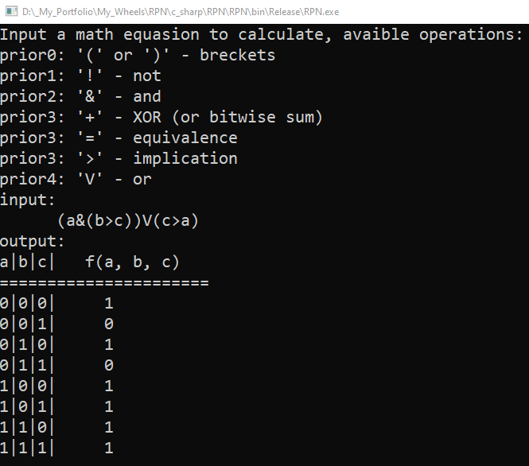

# Technology used
C#, Console, math, algorithms

# Overview
Program that implements [Reverse Polish Notation](https://en.wikipedia.org/wiki/Reverse_Polish_notation) and uses it to solve [boolean functions](https://en.wikipedia.org/wiki/Boolean_function).

# About project
This project was inspired by the course of discrete math, when we were solving boolean functions, but needed some *magic* to verify our solutions.

So I made this.

Also as a bonus I've made a library based on the program :)

Basically UI is easy: User enters some boolean function and program builds solution table of the function.

## Examples

