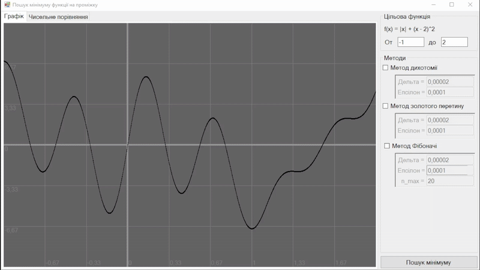

# Technology used
C#, WindowsForms, math, algorithms

# Overview
Program that implements three algorithm of search of minimum of the function on some segment. Particularly [bisection](https://en.wikipedia.org/wiki/Bisection_method), [golden-section](https://en.wikipedia.org/wiki/Golden-section_search) and [Fibonacci search](https://en.wikipedia.org/wiki/Fibonacci_search_technique) methods

# About project
There is given function:

$$f(x)=|x|+(x-2)^2$$

And a segment on which we are searching.

In each method user can chose **delta**(the minimal step) and **epsilon**(the precision).

In program user can compare all three methods both visually and numeracally.

## Examples

