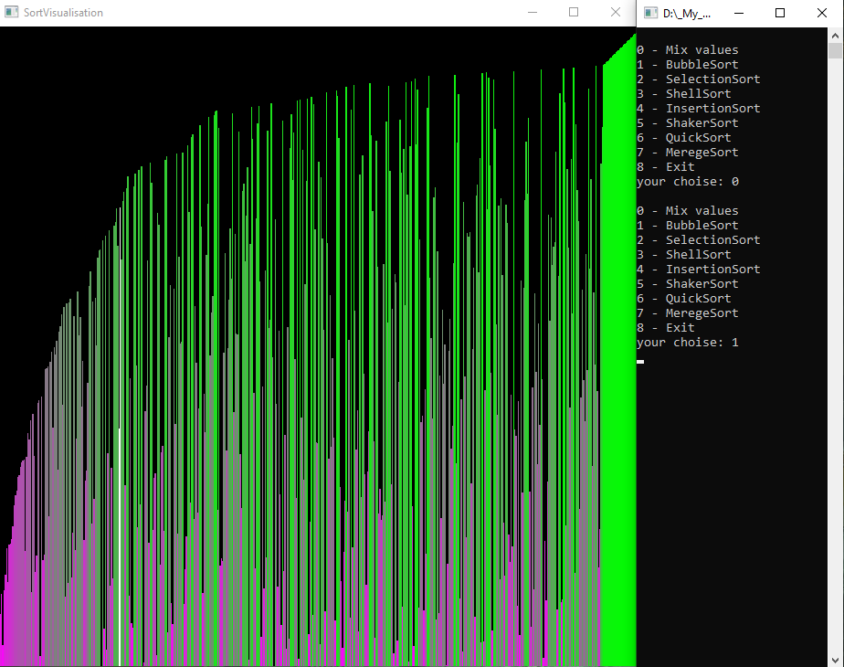

# Sort visualisation

## Technology used
C++, OpenGL, GLFW, Algorithm, VisualStudio

## Overview
Visualisation of different [sorting technics](https://en.wikipedia.org/wiki/Sorting_algorithm).

## About project
In this project I implemented 6 most known algorithms of sorting an array.

Specifically:
- [Bubble Sort](https://en.wikipedia.org/wiki/Bubble_sort)
- [Selection Sort](https://en.wikipedia.org/wiki/Selection_sort)
- [Shell Sort](https://en.wikipedia.org/wiki/Shellsort)
- [Insertion Sort](https://en.wikipedia.org/wiki/Insertion_sort)
- [Shaker Sort](https://en.wikipedia.org/wiki/Cocktail_shaker_sort)
- [Quick Sort](https://en.wikipedia.org/wiki/Quicksort)
- [Merege Sort](https://en.wikipedia.org/wiki/Merge_sort)

This project is half-console: to mix values or do any operation you should input it in the console. But the visual part of sorting is in the separate window.

## Program example
