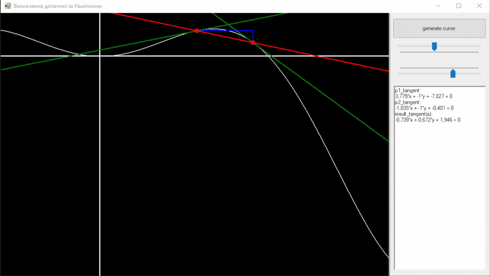

# Technology used
C#, WindowsForms, math, algorithms

# Overview
Program that implements [Newton's notation](https://en.wikipedia.org/wiki/Newton%27s_method) about [tangent](https://en.wikipedia.org/wiki/Tangent) on the curve and visually shows what derivative is.

# About project
This project was made as visualisation approach for one of the math analysis course theme.

## Examples

