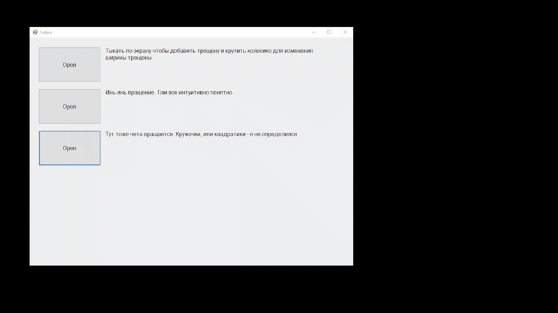

# Technology used
C#, WindowsForms, math

# Overview
Program that I made for fun and beauty of the looped gifs.

# About project
In this project I made interactive ornaments based on some gifs from internet

Currently there are only three of them, but in future i'll probably add some more

### Cracks
In this interactive ornament user clicks on the window and in those places happens division. Also user can change size of those cracks using mouse wheel.

### Yin-Yang
In this ornament user can change speed of rotation of Yin-Yang symbol.

The user can change the number of internal Yin-Yang symbols.

And last, but not least - user can change speed multiplier of the inner Yin-Yang symbols.

When the multiplier is integer - the rotation becomes very beautiful to look at :)

### Rotating squares
In this ornament there are squares arranged in a checkerboard pattern.

All of them rotate simultaneously in one direction around itself.

Every time they turn 90 degrees the background becomes foreground and everything repeats again.

The user can control size of those squares, its speed and color.

## Examples

